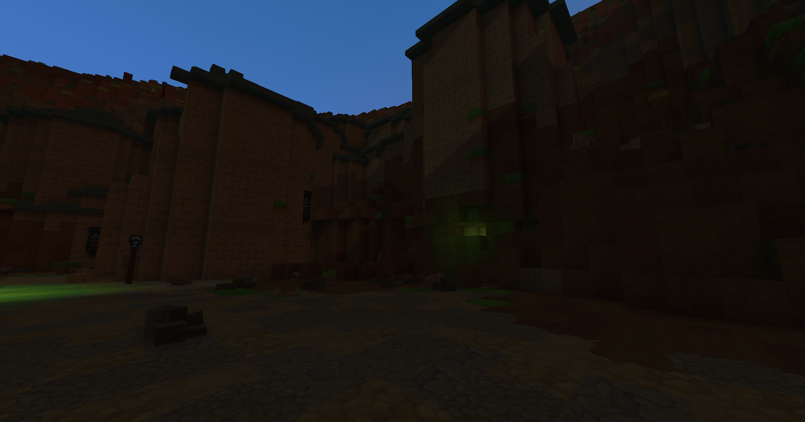
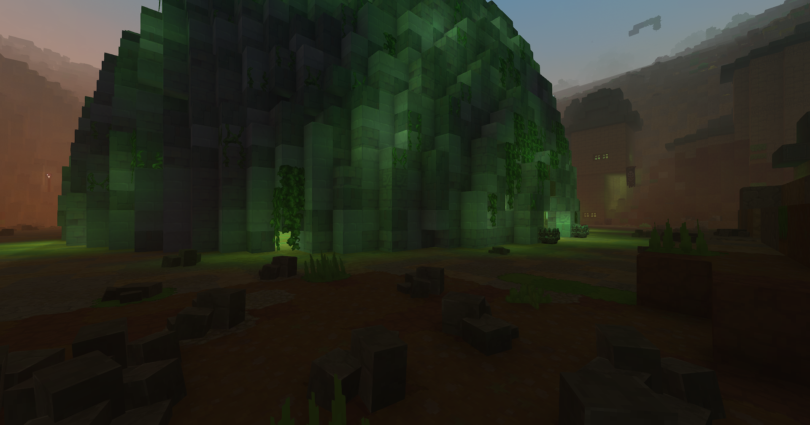
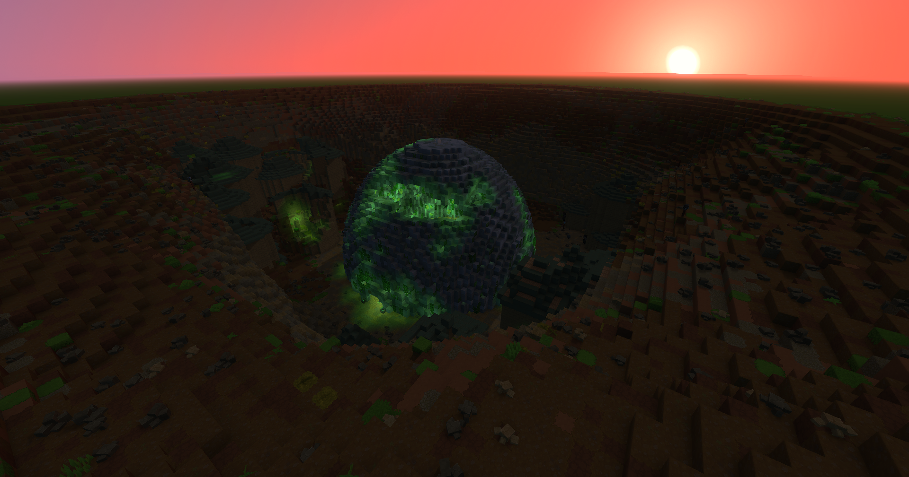
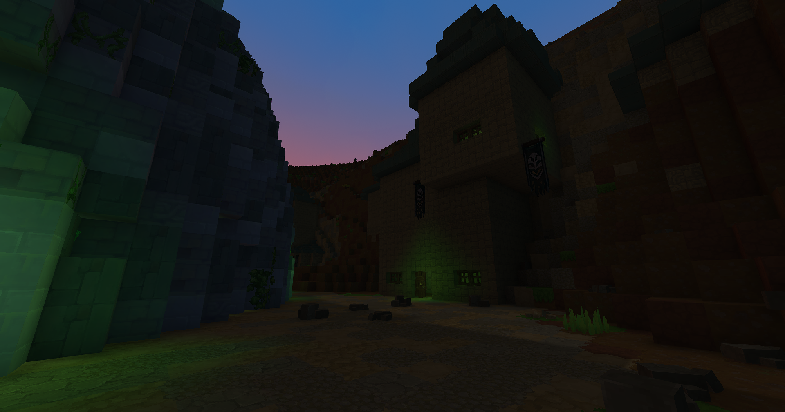

import { Tabs, TabItem } from '@astrojs/starlight/components';

## Showcase
 
 

> **⚠️ Warning: Early Access**
> The game Hytale is in early access, and so is this project! Features may be
> incomplete, unstable, or change frequently. Please be patient and understanding as development
> continues.
 
 

An automation mod for Hytale that allows building solutions to logistical problems, while trying to remain vanilla flavored.

 
 
<Tabs>
    <TabItem label="1" icon="eye">
        
    </TabItem>
    <TabItem label="2" icon="eye">
        
    </TabItem>
    <TabItem label="3" icon="eye">
        
    </TabItem>
    <TabItem label="4" icon="eye">
        
    </TabItem>
    <TabItem label="5" icon="eye">
        
    </TabItem>
</Tabs>

---
Project released under license [GNU AGPLv3](/Lalyan-Documentation/en/license/).