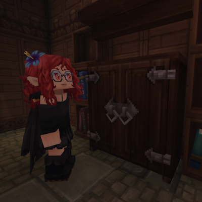

import { Tabs, TabItem } from '@astrojs/starlight/components';

## Presentazione
 
 

Mod fatta da [Good Witch Lalya](https://www.curseforge.com/members/goodwitchlalya/) e [MtChloe05](https://www.curseforge.com/members/mtchloe05).

> **⚠️ Attenzione: Early Access**
> Il gioco Hytale è in accesso anticipato, e così questo progetto! Le funzioni
> potrebbero essere incomplete, instabili o variare spesso. Sii paziente e
> comprensivə mentre lo sviluppo continua.
 
 

Lalyan Cosmetic Core è un API per Hytale Che permette ad i giocatori di indossare e personalizzare oggetti cosmetici senza occupare gli slot armatura.

 
 
<Tabs>
    <TabItem label="1" icon="eye">
        
    </TabItem>
</Tabs>

## Problemi

Se riscontri problemi con la mod, per favore contattami all'indirizzo goodwitchlalya@gmail.com o su [curseforge](https://www.curseforge.com/members/goodwitchlalya/).

Quando segnali un bug assicurati di scrivere:

- A quale delle mie mod ti riferisci.
- La versione della mod che stai Usando.
- Un'immagine o un video del problema (se puoi).
- Il log (sarebbe molto utile).
- Le altre mod che stai utilizzando.

#### Emails
Per favore, usa `Mod-issues` come oggetto dell'email.

---
Progetto rilasciato sotto licenza [GNU AGPLv3](/Lalyan-Projects/it/license/).